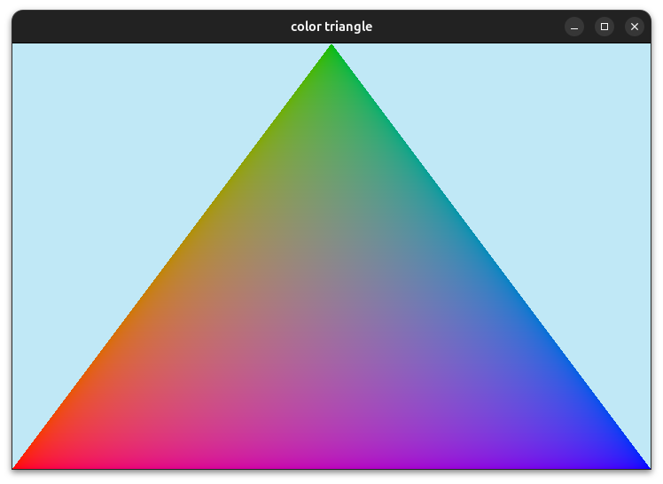

# hlg  (High Level Graphics)
This project is a WIP. The goal is to make a high level graphics api for golang.

[](https://pkg.go.dev/github.com/dfirebaugh/hlg)
Documentation: https://dfirebaugh.github.io/hlg/

### Examples
check the `./examples` dir for some basic examples


#### Triangle

```golang
package main

import (
	"github.com/dfirebaugh/hlg"
	"golang.org/x/image/colornames"
)

var triangle hlg.Shape

// update operation need to happen less frequently than render operations
func update() {
}

func render() {
	hlg.Clear(colornames.Skyblue)
	triangle.Render()
}

func main() {
	hlg.SetWindowSize(720, 480)
	hlg.SetScreenSize(240, 160)
	triangle = hlg.Triangle(0, 160, 120, 0, 240, 160, colornames.Orangered)

	hlg.Run(update, render)
}
```


#### Colored Triangle

```golang
package main

import (
	"image/color"

	"github.com/dfirebaugh/hlg"
	"golang.org/x/image/colornames"
)

var triangle hlg.Shape

// update operations happen less frequently than render operations
func update() {
}

func render() {
	hlg.Clear(colornames.Skyblue)
	triangle.Render()
}

func main() {
	hlg.SetWindowSize(720, 480)
	hlg.SetScreenSize(240, 160)

	triangle = hlg.PolygonFromVertices(0, 0, 0, []hlg.Vertex{
		{
			Position: [3]float32{0, 160, 0},
			Color:    toRGBA(colornames.Red),
		},
		{
			Position: [3]float32{120, 0, 0},
			Color:    toRGBA(colornames.Green),
		},
		{
			Position: [3]float32{240, 160, 0},
			Color:    toRGBA(colornames.Blue),
		},
	})

	hlg.Run(update, render)
}

func toRGBA(c color.Color) [4]float32 {
	r, g, b, a := c.RGBA()
	return [4]float32{
		float32(r) / 0xffff,
		float32(g) / 0xffff,
		float32(b) / 0xffff,
		float32(a) / 0xffff,
	}
}
```



