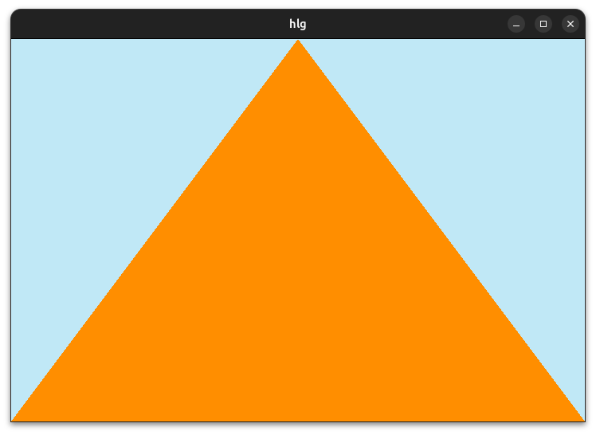

# ggez
This project is a WIP. The goal is to make a high level graphics api for golang.

### Examples
check the `./examples` dir for some basic examples


#### Triangle

```golang
package main

import (
	"github.com/dfirebaugh/ggez"
	"golang.org/x/image/colornames"
)

func main() {
	t := ggez.Triangle(0, 160, 120, 0, 240, 160, colornames.Orangered)
	ggez.Update(func() {
		ggez.Clear(colornames.Skyblue)
		t.Render()
	})
}
```

