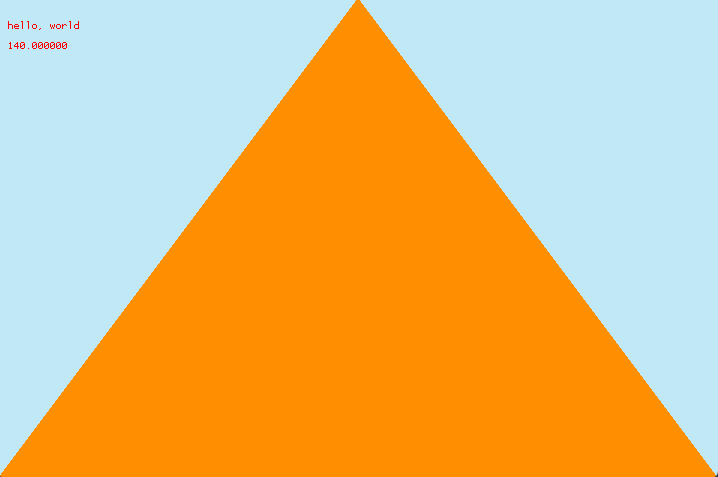

# Debug

## PrintAt
You can print to the screen with the following:
```golang
func PrintAt(s string, x int, y int, c color.Color)
```

### Example
```golang
package main

import (
	"github.com/dfirebaugh/hlg"
	"golang.org/x/image/colornames"
)

func update() {
	hlg.Clear(colornames.Grey)
	hlg.PrintAt("hello, world", 10, 30, colornames.Red)
}

func main() {
	hlg.SetWindowSize(200, 200)
	hlg.Update(update)
}
```

## FPS

To see the current FPS (frames per second), you can call this function
```golang
func GetFPS() float64
```

To show the fps in the window title, you can enable it with:
```golang
hlg.EnableFPS()
```

### Example

```golang
package main

import (
	"fmt"

	"github.com/dfirebaugh/hlg"
	"golang.org/x/image/colornames"
)

func main() {
	hlg.SetWindowSize(720, 480)
	hlg.SetScreenSize(240, 160)
	t := hlg.Triangle(0, 160, 120, 0, 240, 160, colornames.Orangered)

	hlg.EnableFPS()

	hlg.Update(func() {
		hlg.Clear(colornames.Skyblue)
		t.Render()
		hlg.PrintAt("hello, world", 10, 30, colornames.Red)
		hlg.PrintAt(fmt.Sprintf("%f", hlg.GetFPS()), 10, 50, colornames.Red)
	})
}
```


